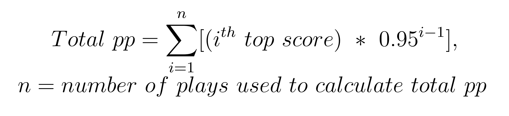
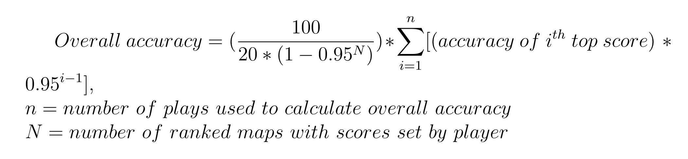
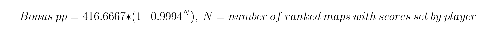

# Calculations

Before I go into details about the calculations, if you would like to take a look at the osu! API that I will subsequently be referencing very often you can find it [here](https://osu.ppy.sh/docs/index.html).

Due to limitations of 
1) my knowledge of how to utilise the osu! API, 
2) the API itself, and 
3) how things like bonus pp and overall accuracy are calculated, 

some (if not all) calculations cannot be 100% accurate. This page details exactly how the calculator works, and assumptions, compromises, and workarounds made. 

## Calculating performance points (pp) 

Calculating for pp was probably the least troublesome out of the three. The formula and explanation for total raw (i.e without bonus) pp can be found on the osu! website [here](https://osu.ppy.sh/wiki/en/Performance_points#weightage-system), and essentially looks like this: 

The API only allows access to total overall pp (the one you see on your profile), so I first calculated the total raw pp using the formula above, and then the bonus pp is calculated by simply finding the difference between the two. There is actually a formula given for bonus pp [here](https://osu.ppy.sh/wiki/en/Performance_points#how-much-bonus-pp-is-awarded-for-having-lots-of-scores-on-ranked-maps?) that I did not use because it gives an incorrect value. As for why this formula for bonus pp and the one for raw pp above do not seem to add up, your guess is as good as mine. 

The way pp is recalculated by this program when you 'delete' scores is just to use the formula above but exclude those scores that have been 'deleted', then add the precalculated bonus pp. 

### Limitations and future fixes

Were you to delete your top score for example, each of your top plays shifts up by 1 spot. What this means is that your 101st top play becomes your 100th and should be included in the calculation. However, the API only allows access to your top 100 plays, meaning the pp that would come from the 101st-turned-100th play cannot be obtained, so deleting one play means the new pp is calculated with only 99 plays. This is not a big issue if only a few plays are removed (the bottom few plays are scaled by 0.9599, 0.9598, etc, so not being able to include a few is relatively inconsequential), but the more plays you 'delete', the less accurate the recalculated pp value is going to be.

Not much can be done to mitigate this issue at this time.

## Calculating overall accuracy

The best way to calculate overall accuracy was annoying to figure out for a number of reasons, the main one being that the osu! website does not give a specific formula, like for performance points. I did eventually manage to find [this](https://www.reddit.com/r/osugame/comments/ahdnre/comment/eedrmjl/?utm_source=share&utm_medium=web2x&context=3) comment by Magnus Cosmos on r/osugame who explains that the formula used to calculate overall accuracy is this: 

The comment also gives a link to the exact line in the osu! source code that he referenced, so check that out if you want to. 

`N = number of ranked scores by player` refers to the number of ranked maps on which a score has been submitted by the player (not sure this needed clarification but whatever). This is not an available statistic on your normal osu! profile page but there are multiple ways to find this value. It can be obtained:

1) directly via the API. 
2) by using [this](https://osu.ppy.sh/wiki/en/Performance_points#how-much-bonus-pp-is-awarded-for-having-lots-of-scores-on-ranked-maps?) formula (that I also mentioned above in the pp calculation section). 
3) working backwards using the player's displayed overall accuracy (the one on your profile page, also attainable via the API).

More details can be found in the appendix below if you're interested, but in short, experimenting with values obtained by methods 1 and 2 resulted in inaccurate values. Hence, by method 3, the player's overall accuracy is plugged into the above equation which is then solved for the value of N. This value is then used for subsequent calculations of overall accuracy.

### Limitations and future fixes

The main limitation with this solution essentially that of the pp calculation: deleting more plays will result in a more inaccurate estimation of overall accuracy. The effect can be seen in the fact that the more plays you delete, the lower your accuracy is, even if you're only removing low accuracy plays.

I'm not sure exactly how to go about fixing this at this time.

## Calculating rank

Rank recalculations were probably the most scuffed of all of them. There is no way to obtain the rank corresponding to a given pp value or vice versa using the API. There is an [online tool](https://osudaily.net/ppbrowser.php) that can do that, but it is regrettably not open source so I am not sure how it works.

The best way that I figured it could be done was to instead make rank estimations based on the Singapore country leaderboard. The current implementation uses the API to copy the entire SG leaderboard once a day, which is then used to estimate rank by finding the closest rank corresponding to the given pp value.

As for why the Singapore country leaderboard specifically and not the global leaderboard or other countries', 1) I'm Singaporean and 2) I think it covers a decent range of rank and pp values (ranks 113 down to ~729000, 14020 down to ~640pp) compared to using the global leaderboard or countries like the US where it's impossible to estimate ranks for players with lower rank/pp.

### Limitations and future fixes

This solution, while one that sort of works at the moment, has a lot of obvious issues. 

Firstly, it's not a perfect estimate since it's unlikely there is a player for every possible pp value. For example:

As of when this screenshot was taken, AceGain is at global rank 46008 with 5017pp while I (begora_) am at global rank 46055 with 5015pp. There is no way to accurately derive one specific rank in the range of 46008 to 46055 for a player with 5016pp, hence a slightly inaccurate estimate.

Secondly, there is currently no way to find the rank of a player with greater than 14020pp (Demonical's pp) or less than 638pp (the pp at the #10000 on the leaderboard). In such cases, the estimated rank defaults to 113 (Demonical's rank) or ~729000 (#10000 on the leaderboard) respectively.

As a fix for the players above rank 113, I'm looking into a working solution by getting the ranks/pp of players from the global leaderboard. There is no easy fix for the players below rank ~729000 however, but I'm thinking about using other country leaderboards.

## Issues

If you have any questions about/suggestions for/issues with the current implementation, feel free to open an issue [here](https://github.com/ntwbruce/osu-calc/issues).

## Appendix: Accuracy calculations

We will calculate three values of N (number of ranked maps with scores set by player) using the three different methods mentioned above in the section for calculating overall accuracy. We will refer to them as N1, N2 and N3 in the same order as above. For the purpose of demonstration, the following values used here were obtained from my profile at 24 December 2021, 03:00AM UTC+8:

Total pp: 5105.28 
Overall accuracy: 96.8531 
Number of ranked maps played (N1): 4600 

Using [this](https://osu.ppy.sh/wiki/en/Performance_points#weightage-system) formula for raw pp:

 

Total raw pp: 4674.66632 
Bonus pp: 340.61368 

Working backwards to find N with [this](https://osu.ppy.sh/wiki/en/Performance_points#how-much-bonus-pp-is-awarded-for-having-lots-of-scores-on-ranked-maps?) formula:  

 

Number of ranked maps played (N2): 2833.91 ≈ 2834 

Working backwards to find N with [this](https://github.com/ppy/osu-performance/blob/92b3eaf832f79eb3e0731c4ce75a8944a2e7b48f/src/performance/User.cpp#L63) formula:  

 

Number of ranked maps played (N3): 100.13 ≈ 100 

Plugging N1 or N2 into the Overall Accuracy equation returns values of approximately 96.28, which is obviously incorrect despite the fact that 4600 and 2834 are more realistic values for the number of ranked maps played (speaking personally) than 100. Hence, as mentioned in the section for calculating profile accuracy, the program calculates profile accuracy using the method involving N3.
